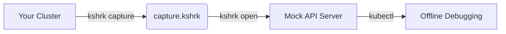

<p align="center">
  
</p>

> Like Wireshark, but for Kubernetes.


> **Customer cluster is broken. You can't get access. You can't reproduce it. k8shark fixes that.**

> **Important:** `k8shark` is under active development. Performance and architecture work is landing quickly, and some updates can be backward-incompatible until the API and archive format stabilize.
>
> For production usage, prefer the latest release candidate (`v0.2.0-rc.N`) so you get compatibility fixes and the current capture/replay behavior.

**k8shark** captures a Kubernetes cluster's state over time and packages it into a single portable archive. A built-in mock API server lets support engineers replay that archive exactly like a live cluster — no direct connectivity required.

A customer hands over one file. A support engineer queries the environment interactively, without live cluster access or back-and-forth command output.

## How it works



1. **Capture** — `kshrk capture` polls the Kubernetes API at configured intervals for a set duration and packages all responses into a single `.kshrk` archive.
2. **Open** — `kshrk open capture.kshrk` reads the archive, starts a local mock HTTPS API server, and writes a kubeconfig. Set `KUBECONFIG` and use `kubectl` normally.

## Quick start

```sh
# Install
brew install phenixblue/tap/k8shark

# Capture cluster state for 10 minutes
kshrk capture --config k8shark.yaml

# Replay the capture
kshrk open capture.kshrk
export KUBECONFIG=~/.kube/k8shark-<id>.yaml
kubectl get pods -A
```

## Web UI (Experimental)

`kshrk ui capture.kshrk` starts a local dashboard for browsing a capture — namespaces, workloads,
pods, and every other captured resource — with object YAML/JSON, relationships, a watch-event
timeline, and a time-travel scrubber. See **[docs/web-ui.md](docs/web-ui.md)** for a full tour.

[](docs/web-ui.md)

⚠️ **Note:** The web UI for cluster exploration is experimental. Replay memory is bounded by in-memory caches (≈128 MiB of record bodies + 32 MiB of responses) plus the capture index, so it stays modest even for large captures: a synthetic capture with ~480 MiB of record data (30k records, 45 MiB archive) replays in well under 200 MiB of heap. Even so, for very large clusters you can keep captures smaller with an explicit resource list instead of `all: true`. (See `BenchmarkServeLargeCapture` / `TestLargeCaptureMemory` in `internal/server` to reproduce.)

## Documentation

| Doc | Description |
|-----|-------------|
| [docs/usage.md](docs/usage.md) | Installation, capture and open workflows, all CLI flags, kubectl compatibility |
| [docs/web-ui.md](docs/web-ui.md) | Web UI tour — dashboard, namespaces/workloads/pods, object views, filtering, timeline, themes |
| [docs/config.md](docs/config.md) | Config file reference, namespaced vs cluster-scoped resources, example configs |
| [docs/releases.md](docs/releases.md) | How to cut a release, GoReleaser pipeline, signing, Homebrew tap |
| [docs/development.md](docs/development.md) | Building, testing, linting, KinD dev cluster, E2E tests, package layout |
| [docs/archive-format.md](docs/archive-format.md) | Internal `.kshrk` (ZIP+Zstd) layout, record and index JSON schemas, and the format-compatibility guarantee |

## License

Apache 2.0
