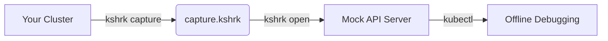
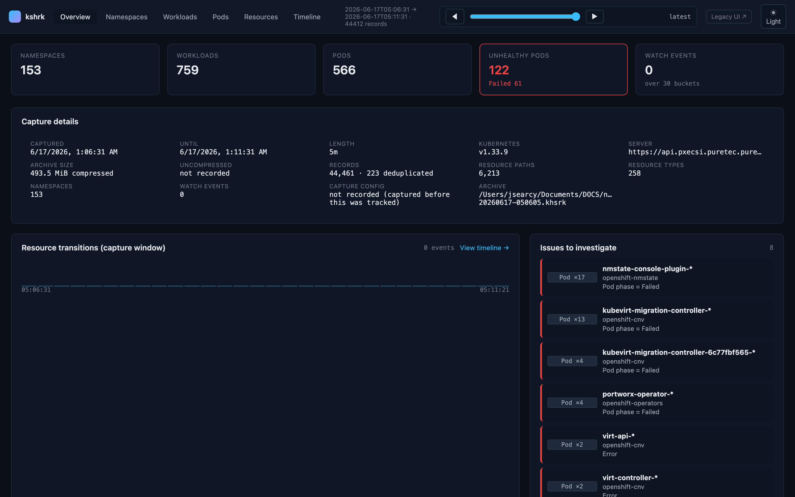

<p align="center">
  
</p>

> Like Wireshark, but for Kubernetes.


> **Customer cluster is broken. You can't get access. You can't reproduce it. k8shark fixes that.**

**k8shark** captures a Kubernetes cluster's state over time and packages it into a single portable archive. A built-in mock API server lets support engineers replay that archive exactly like a live cluster — no direct connectivity required.

A customer hands over one file. A support engineer queries the environment interactively, without live cluster access or back-and-forth command output.

## How it works


```mermaid
flowchart LR
    A[Your Cluster] -->|kshrk capture| B(capture.kshrk)
    B -->|kshrk open| C[Mock API Server]
    C -->|kubectl| D[Offline Debugging]
```

1. **Capture** — `kshrk capture` polls the Kubernetes API at configured intervals for a set duration and packages all responses into a single `.kshrk` archive.
2. **Open** — `kshrk open capture.kshrk` reads the archive, starts a local mock HTTPS API server, and writes a kubeconfig. Set `KUBECONFIG` and use `kubectl` normally.
3. **Diagnose** — `kshrk diagnose capture.kshrk` analyzes the capture offline and prints severity-ranked findings (crashing pods, unschedulable workloads, unbound PVCs, version skew, …). Also available in the web UI's Diagnostics tab.

Which Kubernetes/kubectl versions and platforms are supported? See the
[compatibility matrix](docs/usage.md#compatibility-matrix). Deciding what
RBAC a capture needs? See the [RBAC guide](docs/rbac.md).

## Quick start

```sh
# Install
brew install --cask phenixblue/tap/k8shark

# Capture a live cluster for 2 minutes — no config file needed
kshrk capture --auto-discover --duration 2m --out capture.kshrk

# Ask what's broken, entirely offline
kshrk diagnose capture.kshrk

# Or explore it with kubectl — starts a local mock API server
kshrk open capture.kshrk --kubeconfig-out ./kubeconfig
#   then, in another shell:
export KUBECONFIG=./kubeconfig
kubectl get pods -A

# Or browse it in the web dashboard
kshrk ui capture.kshrk
```

`--auto-discover` captures every API resource your credentials can read, which
is the fastest way to a first archive. For repeatable or scoped captures —
specific resources, namespaces, and poll intervals — use a config file instead:

```sh
kshrk capture --config examples/k8shark.yaml   # requires a clone of this repo
```

See [docs/config.md](docs/config.md) for the schema and
[examples/k8shark.yaml](examples/k8shark.yaml) for a starter config.

> **macOS:** the binaries aren't Apple-notarized yet ([#316](https://github.com/phenixblue/k8shark/issues/316)),
> and Homebrew quarantines cask installs, so the first run is blocked by Gatekeeper.
> Approve it once in System Settings → Privacy & Security, or run
> `xattr -d com.apple.quarantine "$(brew --prefix)/bin/kshrk"`. See
> [docs/usage.md](docs/usage.md#macos-first-run-is-blocked-by-gatekeeper).

No cluster on hand? Skip straight to [Examples](#examples) below — five pre-recorded
captures you can replay immediately, no live cluster required.

## Examples

`examples/` ships five self-contained, pre-recorded captures — a minimal first
capture, multi-namespace, a `CrashLoopBackOff` investigation, a watch-driven
rolling update, and full-cluster auto-discovery — each with its own `README.md`
walking through what to try:

```sh
kshrk open examples/basic-workloads/capture.kshrk
```

See **[examples/README.md](examples/README.md)** for the full list.

## Web UI (Experimental)

`kshrk ui capture.kshrk` starts a local dashboard for browsing a capture — namespaces, workloads,
pods, and every other captured resource — with object YAML/JSON, relationships, a watch-event
timeline, and a time-travel scrubber. See **[docs/web-ui.md](docs/web-ui.md)** for a full tour.

[](docs/web-ui.md)

⚠️ **Note:** The web UI for cluster exploration is experimental. Replay memory is bounded by in-memory caches (≈128 MiB of record bodies + 32 MiB of responses, a ~160 MiB ceiling) plus the capture index, so it stays modest even for large captures: a synthetic capture with ~470 MiB of record data (48k records, ~56 MiB archive) replays with a steady-state retained footprint of ~20 MiB (measured post-GC) — bounded by the caches, not the capture size. Even so, for very large clusters you can keep captures smaller with an explicit resource list instead of `all: true`. (See `BenchmarkServeLargeCapture` / `TestLargeCaptureMemory` in `internal/server` to reproduce.)

## Documentation

| Doc | Description |
|-----|-------------|
| [docs/usage.md](docs/usage.md) | Installation, a curated per-command walkthrough with worked examples, kubectl compatibility |
| [docs/cli-reference.md](docs/cli-reference.md) | Generated, always-accurate reference for every command and flag (`make docs`) |
| [docs/web-ui.md](docs/web-ui.md) | Web UI tour — dashboard, namespaces/workloads/pods, object views, filtering, timeline, themes |
| [docs/config.md](docs/config.md) | Config file reference, namespaced vs cluster-scoped resources, example configs |
| [docs/releases.md](docs/releases.md) | How to cut a release, GoReleaser pipeline, signing, Homebrew tap |
| [docs/development.md](docs/development.md) | Building, testing, linting, KinD dev cluster, E2E tests, package layout |
| [docs/archive-format.md](docs/archive-format.md) | Internal `.kshrk` (ZIP+Zstd) layout, record and index JSON schemas, and the format-compatibility guarantee |
| [docs/stability-policy.md](docs/stability-policy.md) | What's covered by semver from `v1.0.0` on — CLI surface, exit codes, JSON output, config schema, kubeconfig, deprecation and backport policy |
| [docs/encryption-threat-model.md](docs/encryption-threat-model.md) | What `--encrypt` protects (and doesn't), key-handling rules, passphrase vs. recipient keys |
| [docs/kwok.md](docs/kwok.md) | Closed-loop controller dev: `--writable` replay driven by KWOK and kube-controller-manager |
| [docs/conformance.md](docs/conformance.md) | Mock-server conformance methodology and accepted divergences from a real API server |
| [docs/rbac.md](docs/rbac.md) | What RBAC permissions a capture needs — minimal explicit-resource grant, the broader `all: true` grant, and what a partial-permissions capture looks like |

## License

Apache 2.0
