# Web UI

`kshrk ui` starts a local, browser-based explorer for a capture archive together with the mock
Kubernetes API server. The explorer lets you browse a captured cluster the way you would a live one —
namespaces, workloads, pods, and every other captured resource — and to step backward and forward
through the capture window.

```sh
kshrk ui capture.kshrk
```

```
k8shark mock server running
  Address:    https://127.0.0.1:51325
  Kubeconfig: ~/.kube/k8shark-abc123def456.yaml

k8shark UI running
  Address: http://127.0.0.1:53421

Open this URL in your browser. Press Ctrl+C to stop.
```

Open the printed address in a browser. The **dashboard** is served at `/` (it redirects to `/v2/`).

> ⚠️ The web UI is experimental. Replay memory is bounded by in-memory caches (≈128 MiB of record
> bodies + 32 MiB of responses, a ~160 MiB ceiling) plus the capture index, so it stays modest even
> for large captures — e.g. a synthetic capture with ~470 MiB of record data (48k records, ~56 MiB
> archive) replays with a steady-state retained footprint of ~20 MiB (measured post-GC), bounded by
> the caches rather than the capture size. For very large clusters you can still prefer an explicit
> resource list over `all: true` to keep captures smaller. See [docs/config.md](config.md).

## Launching

| Flag | Default | Description |
|------|---------|-------------|
| `--port` | from config, else random | Port for the local web UI server |
| `--api-port` | from config, else random | Port for the mock Kubernetes API server |
| `--kubeconfig-out` | `~/.kube/k8shark-<id>.yaml` | Where to write the generated kubeconfig |
| `--at` | latest records | Pin UI data to a specific timestamp (RFC3339 or relative duration, e.g. `-2m`) |

You can pin consistent ports (instead of random ones) with a `ui:` block in your config file. CLI flags
override the config:

```yaml
ui:
  port: "8080"       # local web UI
  api_port: "8081"   # mock Kubernetes API server
```

See [docs/config.md](config.md#web-ui-ports) for details.

## The dashboard at a glance

The **Overview** is the landing page. It summarizes the capture with KPI tiles (namespaces, workloads,
pods, unhealthy pods, watch events), a **Capture details** card (archive size, time window, record
counts, Kubernetes version, resource types, redaction status), a resource-transition strip, the
**Resources captured** breakdown, top namespaces, and an **Issues to investigate** panel that surfaces
CrashLoopBackOff / OOMKilled / failed pods. Every tile and row is a link into the relevant view.

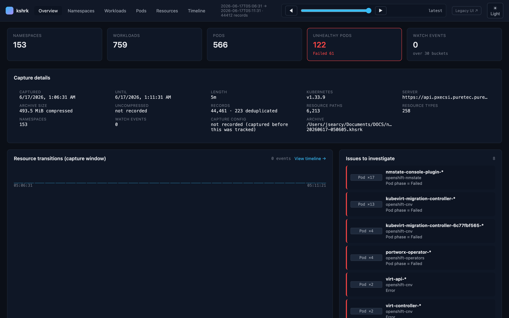

## Browsing namespaces

**Namespaces** is a searchable grid of every captured namespace with at-a-glance workload, pod, and
resource counts, plus an "unhealthy" badge where applicable.

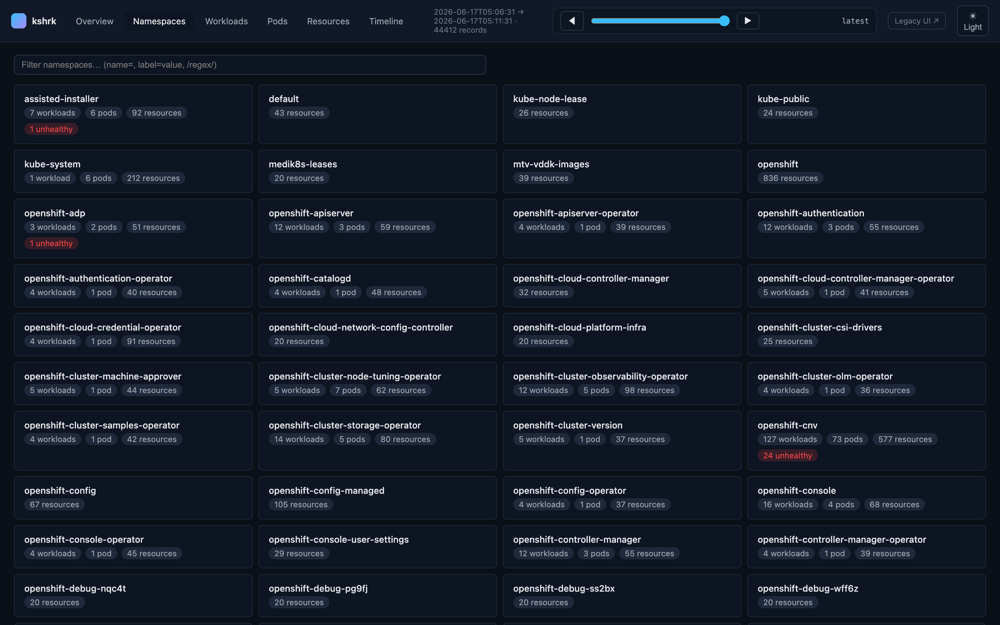

Selecting a namespace drills into it — KPI tiles for the namespace, its workloads and pods, virtual
machines, ConfigMaps, Secrets, and resource tiles, all scoped to that namespace.

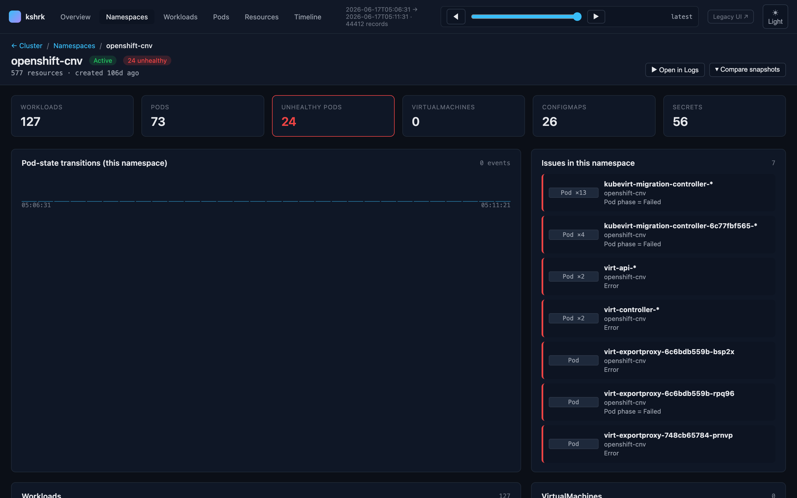

## Workloads and pods

**Workloads** and **Pods** are cluster-wide, sortable lists (unhealthy first) that you can filter with
the chip/token search bar (see [Filtering](#filtering)). Both link straight to per-object detail views.

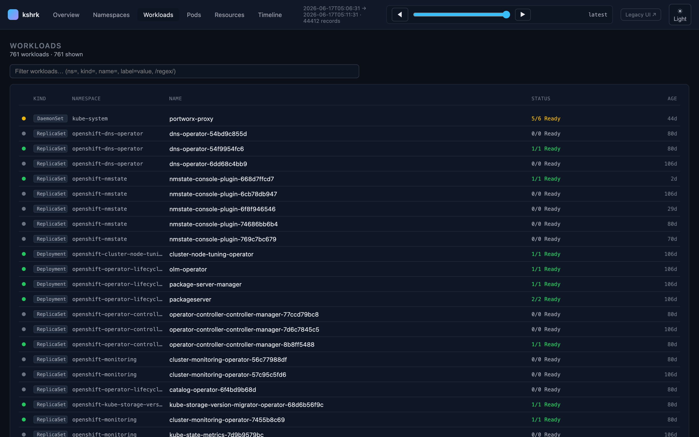

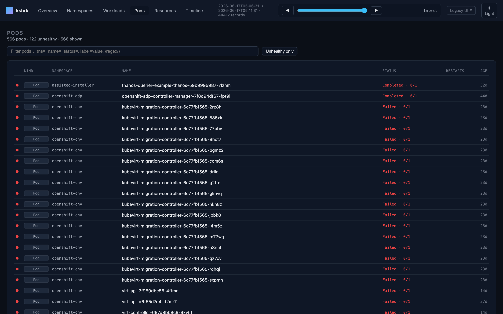

### Pod drill-down

A pod's detail view has tabs for **Summary**, **Containers & Logs**, **Events**, **History**,
**Relationships**, and **YAML**, plus quick actions to open logs or compare snapshots. The summary shows
phase, restarts, age, readiness, node, QoS, labels, conditions, and a container-restart strip across the
capture window.

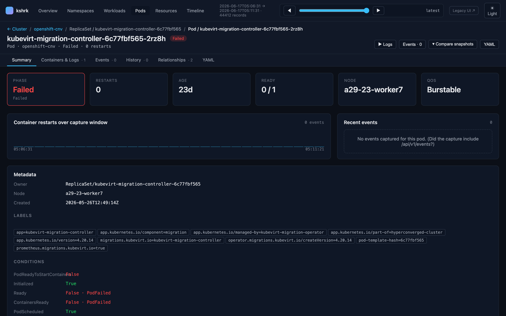

## Resources catalog

**Resources** lists every captured API resource type, grouped by API group, with short names, scope
(namespaced vs. cluster), and object counts. Per-resource and per-group toggles control which resource
types are shown throughout the UI — the equivalent of the v1 sidebar toggles — and the choice persists.

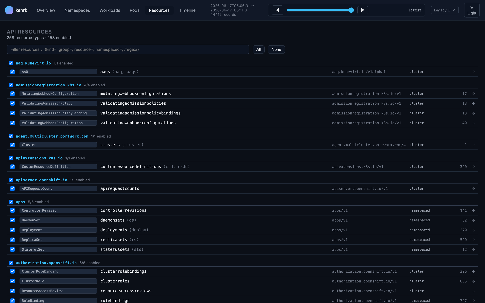

## Object view

Any object — of any kind, including CRDs — opens in a generic detail view with **YAML**, **JSON**,
**Relationships**, **History**, and **Diff** tabs. YAML and JSON are syntax-highlighted with **Copy**
and **Download** buttons.

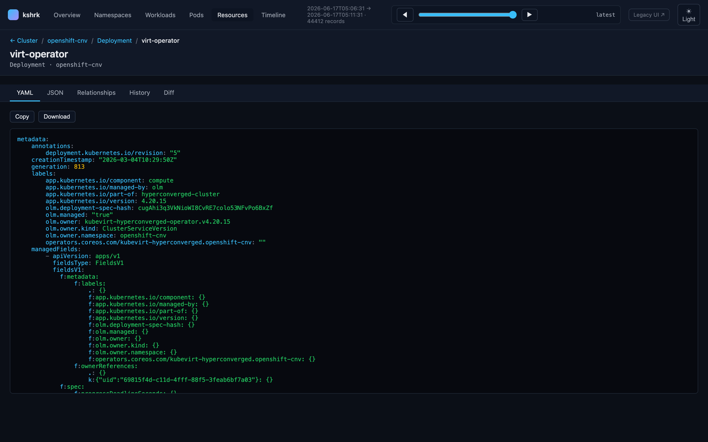

The **Relationships** tab resolves links to and from the object: owner references, owned objects
(e.g. a Deployment's ReplicaSets), and volume/env references (PVC ↔ PV ↔ Pod, ConfigMap/Secret → Pod).

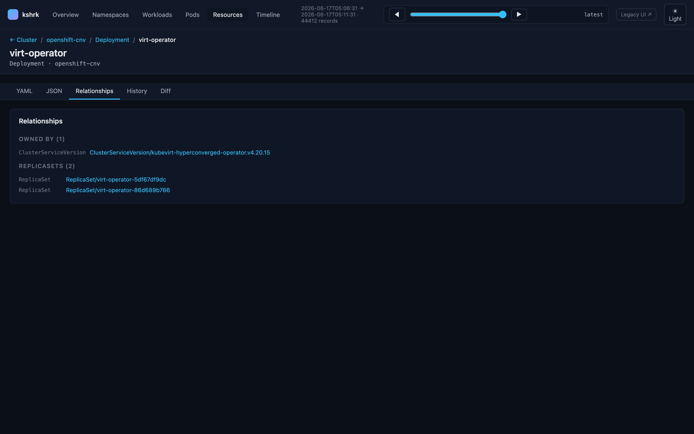

## Diagnostics

The **Diagnostics** tab runs the same analysis as `kshrk diagnose` over the capture and lists
**severity-ranked findings** — CrashLoopBackOff/OOMKilled/image-pull, unschedulable pods, unbound
PVCs, missing requests/limits, unavailable replicas, node pressure/NotReady, version skew, and
deprecated API usage. Each finding shows its category, the affected object (with a grouped count when
several share a cause), the evidence, and a remediation hint; namespaced findings link to the
namespace drill-down. The view honors the time-travel scrubber, so you can diagnose the cluster as it
looked at any point in the capture window. See [docs/usage.md](usage.md#diagnose) for the full rule
catalog and JSON schema.

## Filtering

Every list surface (Pods, Workloads, resource lists, Namespaces, Timeline, and the Resources catalog)
shares a chip/token filter bar with type-ahead completion:

- **Faceted keys** such as `ns=`, `name=`, `status=`, `kind=`, `group=` — start typing a key and press
  **Tab** to complete, then pick a suggested value.
- **Label selectors** — any `key=value` that isn't a built-in facet matches on `metadata.labels`
  (e.g. `app.kubernetes.io/name=virt-operator`).
- **Regex values** — wrap a value in slashes, e.g. `name=/^kube-/`.
- **Multiple chips** combine (AND); suggestions are aggregated and scoped by the chips already applied.
  Hover a chip to remove it, or press Backspace.

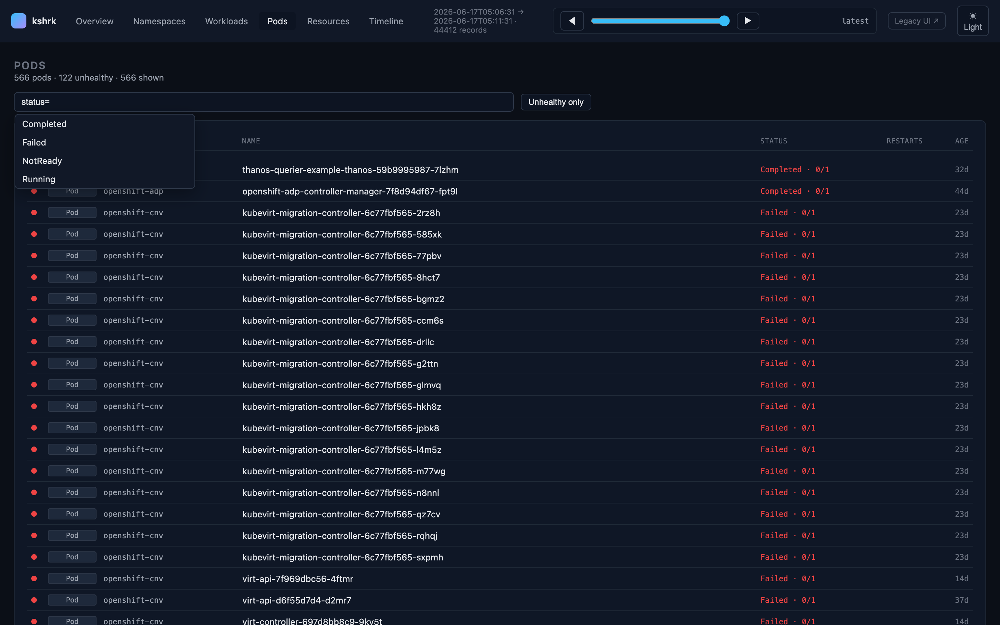

## Timeline and watch events

If the capture was taken with `watch: true` on its resource entries, the **Timeline** plots watch events
(ADDED / MODIFIED / DELETED) across the capture window and lists recent transitions, each filterable and
clickable through to the object.

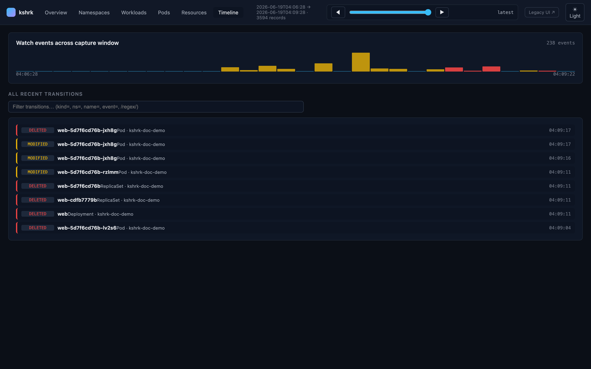

If no watch events were captured, the Timeline explains how to enable them. See
[Capturing watch events](config.md) in the config docs.

## Time travel

The header scrubber pins the entire UI to any point in the capture window — drag the slider or step
with the arrows, and every view re-renders as the cluster looked at that moment. Click **latest** to
jump back to the most recent records. This is the in-browser equivalent of the `--at` flag.

## Replay (VCR)

The dashboard doubles as a **transport for time-based replay**: instead of manually scrubbing, a
replay clock advances through the capture and every view follows it live. Start it either way — both
share one clock, so `kubectl` against the mock server and the dashboard stay in lockstep:

```sh
# dashboard-first
kshrk ui capture.kshrk --speed 2x

# replay-first (also serves the dashboard)
kshrk replay capture.kshrk --speed 2x --ui
```

A **transport bar** appears in the header with **play/pause**, **step** (◀ ▶ on the scrubber),
a **speed selector** (0.5× / 1× / 2× / 3×), and a live **events** counter. Drag the scrubber to seek
the clock; the views auto-refresh as the clock crosses each snapshot. If a view fails to load
mid-playback, replay **pauses** and surfaces the error rather than pressing on.

Replay flags mirror the [`replay` command](usage.md#replay): `--speed`, `--from`, `--to`, `--loop`,
`--start-paused`. See [docs/usage.md](usage.md#replay) for the full model (resourceVersion coherence,
poll-only inference, etc.).

The transport is backed by a small same-origin control API the dashboard calls (also useful for
scripting the UI clock):

| Request | Effect |
|---------|--------|
| `GET /v2/api/replay` | Current status (`{enabled:false}` when not in replay mode) |
| `POST /v2/api/replay/play` · `/pause` | Resume / pause the clock |
| `POST /v2/api/replay/speed?value=2x` | Change speed |
| `POST /v2/api/replay/seek?to=<RFC3339>` | Seek to a time (or `?offset=<duration>` from the window start) |

(The headless `kshrk replay` server exposes the equivalent under `/_k8shark/replay` on the mock API —
see [docs/usage.md](usage.md#controlling-playback).)

## Light and dark themes

Use the toggle at the far right of the header to switch between dark (default) and light themes; the
preference is remembered.

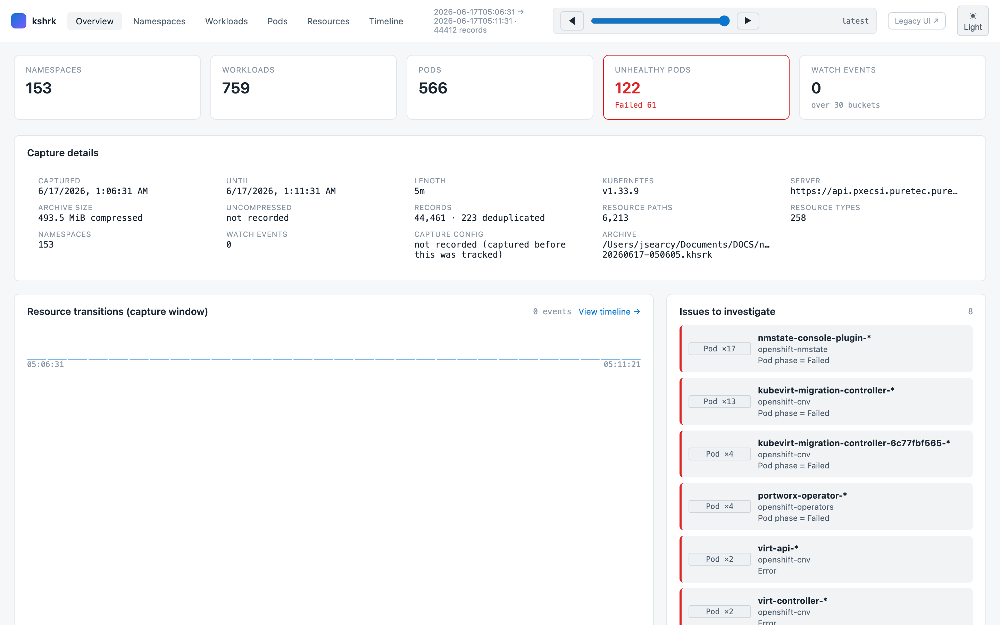
